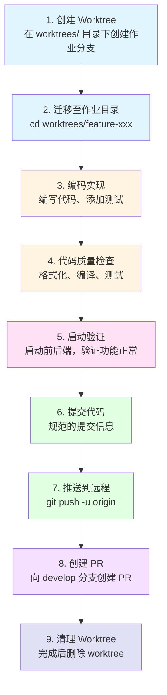

# 开发流程规范

本文规范了从任务开始到 PR 合并的完整开发流程。所有开发任务必须严格遵循此流程。


## 流程概览



## 详细步骤

### 第 1 步：创建 Worktree

在项目根目录下执行：

```bash
# 1. 确保 develop 分支是最新的
git checkout develop
git pull origin develop

# 2. 创建新的功能分支
git checkout -b feature/excel-import-export

# 3. 创建 worktree（必须在 worktrees/ 目录下）
git worktree add worktrees/feature-excel-import-export feature/excel-import-export

# 4. 验证 worktree 创建成功
git worktree list
```

预期输出：
```
/Users/lee0407/dev/projs/auth                                   abc1234 [develop]
/Users/lee0407/dev/projs/auth/worktrees/feature-excel-import-export  def5678 [feature/excel-import-export]
```

### 第 2 步：迁移至作业目录

```bash
# 进入 worktree 目录
cd /Users/lee0407/dev/projs/auth/worktrees/feature-excel-import-export

# 验证当前分支
git branch
# 应显示 * feature/excel-import-export

# 验证工作目录
pwd
# 应显示 /Users/lee0407/dev/projs/auth/worktrees/feature-excel-import-export
```

### 第 3 步：编码实现

在 worktree 中进行开发工作：

```bash
# 创建任务记录文件（可选）
mkdir -p .claude/tmp/tasks/$(date +%Y-%m-%d)
echo "# 任务描述" > .claude/tmp/tasks/$(date +%Y-%m-%d)/task-name.md

# 开始编码
# ... 编写代码 ...
# ... 添加测试 ...
# ... 更新文档 ...
```

编码规范：
- 遵循项目代码风格
- 添加必要的注释和文档
- 编写或更新单元测试
- 更新相关的 API 文档

### 第 4 步：代码质量检查

在提交代码前，必须执行以下检查：

```bash
# 1. 代码格式化
./gradlew spotlessApply

# 2. 检查格式化结果
./gradlew spotlessCheck

# 3. 编译项目
./gradlew build -x test

# 4. 运行测试
./gradlew test

# 5. 如果是前端变更，构建前端
./gradlew :ui:assembleFrontend
```

**检查清单：**
- [ ] Spotless 格式化通过
- [ ] 编译无错误
- [ ] 单元测试通过
- [ ] 前端构建成功（如有前端变更）
- [ ] 无新增警告

### 第 5 步：启动验证

**在提交代码前，必须启动前后端工程验证功能正常：**

#### 配置 hosts 文件（首次使用时）

由于项目使用域名 `auth.local.opensrcdevelop.cn` 进行本地开发，需要先配置 hosts 文件：

```bash
# 编辑 hosts 文件
sudo nano /etc/hosts

# 添加以下行
127.0.0.1  auth.local.opensrcdevelop.cn

# 保存并退出（Ctrl+X，然后 Y，最后 Enter）
```

#### 后端启动验证
```bash
# 在 worktree 目录下启动后端
./gradlew :auth-server:bootRun

# 等待启动完成，检查：
# 1. 无启动错误
# 2. 服务正常运行在指定端口
# 3. 数据库连接正常
# 4. Redis 连接正常

# 访问 Swagger 文档验证 API 端点
# http://localhost:6543/swagger-ui.html

# 验证完成后，使用 Ctrl+C 停止服务
```

#### 前端启动验证
```bash
# 如果有前端变更，启动前端开发服务器
cd ui
npm run dev

# 等待启动完成，检查：
# 1. 无编译错误
# 2. 页面可以正常访问
# 3. API 调用正常
# 4. 新增功能可以正常使用

# 验证完成后，使用 Ctrl+C 停止服务
```

**验证清单：**
- [ ] 后端启动成功，无错误日志
- [ ] 新增 API 端点可用（Swagger 可访问）
- [ ] 前端启动成功（如有前端变更）
- [ ] 前端页面可正常访问
- [ ] 新增功能在前端可正常使用

**验证通过后，告知用户进行检查确认。用户确认通过后，停止前后端服务，再执行后续步骤。**

### 第 6 步：等待用户确认

**验证结果：**

**后端服务：**
- ✓ 启动成功，无错误日志
- ✓ 服务地址：http://auth.local.opensrcdevelop.cn:6543
- ✓ Swagger 文档：http://auth.local.opensrcdevelop.cn:6543/swagger-ui.html
- ✓ 新增 API 端点可用

**前端服务：**
- ✓ 启动成功，无编译错误
- ✓ 页面地址：http://auth.local.opensrcdevelop.cn:4322/ui
- ✓ 新增功能可正常使用

请用户验证上述功能是否正常。验证通过后，通知 AI 停止服务并继续后续步骤。

### 第 7 步：停止服务并提交代码

**用户确认验证通过后，执行以下操作：**

```bash
# 1. 停止前后端服务
pkill -f "auth-server.Application"
pkill -f "vite"

# 2. 查看变更
git status

# 3. 暂存变更
git add .

# 4. 提交（使用规范的提交信息）
git commit -m "类型: 简短描述

详细描述本次变更的内容和原因

- 变更点1
- 变更点2
- 变更点3

Co-Authored-By: Claude <noreply@anthropic.com>"
```

```bash
# 1. 查看变更
git status
git diff

# 2. 暂存变更
git add .

# 3. 提交（使用规范的提交信息）
git commit -m "feat: 添加用户 Excel 导入导出功能

- 实现模版下载，支持动态表头和下拉框约束
- 实现用户数据导出，支持扩展字段
- 实现用户数据导入，支持数据验证
- 添加前端 API 和 UI 交互

Co-Authored-By: Claude <noreply@anthropic.com>"
```

### 第 7 步：推送到远程

```bash
# 推送分支到远程仓库
git push -u origin feature/excel-import-export

# 验证推送成功
git status
```

### 第 8 步：创建 Pull Request

```bash
# 使用 gh CLI 创建 PR
gh pr create \
  --base develop \
  --title "feat: 添加用户 Excel 导入导出功能" \
  --body "$(cat <<'EOF'
## 变更概述
为用户管理模块添加 Excel 导入导出功能，支持扩展信息和动态表头生成。

## 变更类型
- [x] 新功能 (feat)

## 主要变更
- 模版下载：动态生成包含所有用户字段的 Excel 模版
- 数据导出：支持批量导出用户数据到 Excel
- 数据导入：支持从 Excel 批量导入用户数据
- 下拉约束：字典类型字段自动转换为下拉选择

## 测试计划
- [x] 单元测试通过
- [x] 代码格式化通过
- [x] 构建成功
- [ ] 手动测试完成

## 相关 Issue
Closes #

## 截图/演示
（添加相关截图）

## 检查清单
- [x] 代码遵循项目规范
- [x] 已添加必要的注释
- [x] 已更新相关文档
- [x] 无新增警告
EOF
)"
```

或使用 GitHub Web UI 创建 PR：
1. 访问 https://github.com/opensrcdevelop/auth/pull/new/develop...feature/excel-import-export
2. 填写 PR 标题和描述
3. 创建 PR

### 第 9 步：清理 Worktree

PR 创建后，可以清理 worktree：

```bash
# 1. 返回主目录
cd /Users/lee0407/dev/projs/auth

# 2. 删除 worktree
git worktree remove worktrees/feature-excel-import-export

# 3. 验证删除
git worktree list
```

**注意：** 如果 PR 还需要修改，可以保留 worktree 直到 PR 合并。

## 常见问题

### Q1: 如何修复代码审查中的反馈？

```bash
# 1. 进入 worktree 目录
cd worktrees/feature-xxx

# 2. 修改代码
# ... 编辑文件 ...

# 3. 运行检查
./gradlew spotlessApply build test

# 4. 提交变更
git add .
git commit -m "fix: 修复代码审查反馈的问题"

# 5. 推送到远程
git push

# PR 会自动更新
```

### Q2: 如何处理合并冲突？

```bash
# 1. 更新 develop 分支
cd /Users/lee0407/dev/projs/auth
git checkout develop
git pull origin develop

# 2. 进入 worktree
cd worktrees/feature-xxx

# 3. 合并 develop
git merge develop

# 4. 解决冲突
# ... 编辑冲突文件 ...
git add <resolved-files>
git commit -m "chore: 解决与 develop 的合并冲突"

# 5. 推送到远程
git push
```

### Q3: Worktree 损坏如何修复？

```bash
# 1. 删除损坏的 worktree
git worktree remove worktrees/feature-xxx

# 2. 清理无效记录
git worktree prune

# 3. 重新创建 worktree
git worktree add worktrees/feature-xxx feature/xxx
```

## 快捷命令

### 创建新功能的完整流程

```bash
# 一键创建并进入 worktree
git checkout develop && \
git pull origin develop && \
git checkout -b $1 && \
git worktree add worktrees/$1 $1 && \
cd worktrees/$1

# 使用方式：
# ./create-worktree.sh feature/excel-import-export
```

### 提交并推送的标准流程

```bash
# 一键格式化、检查、提交、推送
./gradlew spotlessApply && \
git add . && \
git commit -m "$1" && \
git push

# 使用方式：
# ./commit-push.sh "feat: 添加新功能"
```

## 附录：项目特定命令

### 格式化代码
```bash
# 格式化所有 Java 代码
./gradlew spotlessApply

# 检查格式化
./gradlew spotlessCheck
```

### 构建项目
```bash
# 完整构建
./gradlew build

# 跳过测试构建
./gradlew build -x test

# 仅构建特定模块
./gradlew :auth-biz:build
```

### 运行测试
```bash
# 运行所有测试
./gradlew test

# 运行特定模块的测试
./gradlew :auth-biz:test

# 运行特定测试类
./gradlew test --tests UserServiceTest
```

### 前端相关
```bash
# 构建前端
./gradlew :ui:assembleFrontend

# 运行前端开发服务器
cd ui && npm run dev
```

## 记住

1. **始终在 worktrees/ 目录下创建 worktree**
2. **迁移到 worktree 目录后再开始编码**
3. **提交前必须通过所有检查**
4. **使用规范的提交信息**
5. **完成任务后及时清理 worktree**
