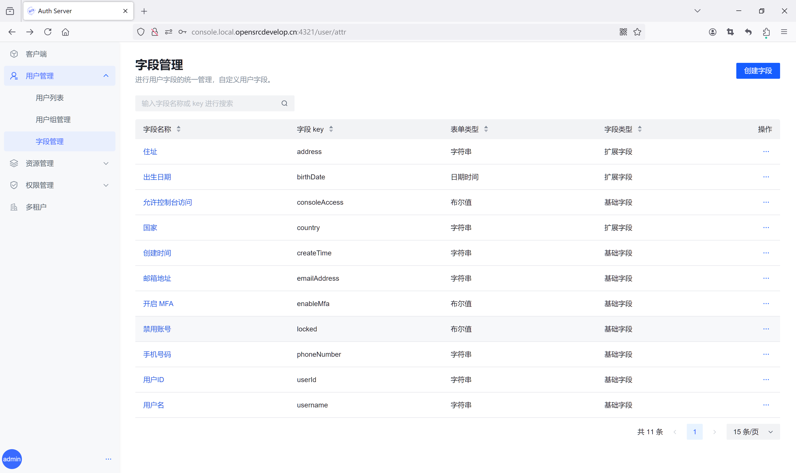
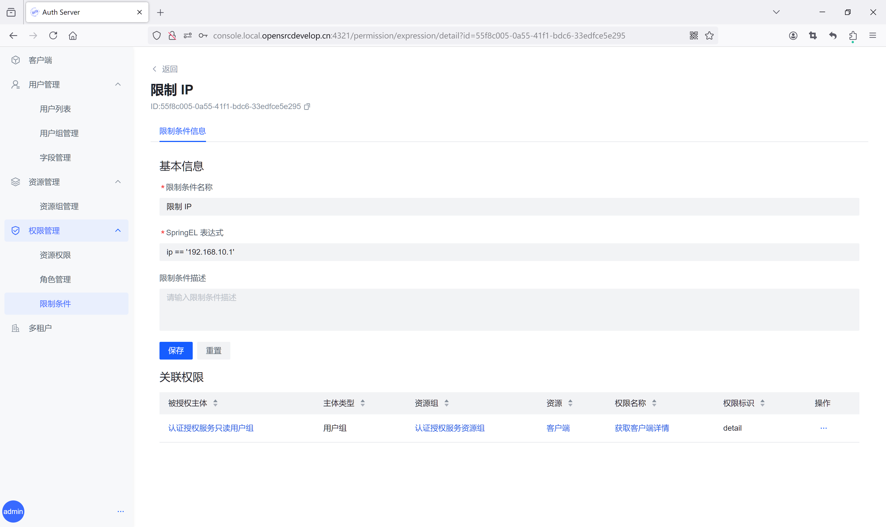

# 认证授权服务（Auth Server）

认证授权服务（Auth Server）以 [**Spring Authorization Server**](https://spring.io/projects/spring-authorization-server) 为框架，提供身份认证协议 **OAuth 2.0** 和 **OIDC** 的实现。扩展其功能，并基于 Spring Security 提供授权鉴权服务。

### 主要技术

- Java 21
- Gradle
- PostgreSQL
- Redis
- Spring Boot 3
- Spring Authorization Server
- Spring Security
- Spring Session
- Spring Doc
- MyBatis
- MyBatis-Plus
- Flyway

### 主要功能

- 客户端
- 用户管理
- 资源管理
- 权限管理
- 多租户
- 个人中心

### 功能概述

- 客户端

  使用 Auth Server 作为服务提供商（**SP**），创建业务客户端集成到 Auth Server 中，配置客户端基本信息和认证协议，开始使用。

  - 配置登录回调 URL
  - 刷新客户端密钥
  - 配置授权模式、客户端认证方式、授权码 及 token 过期时间、配置 OIDC Scope、Claim
    - 可选授权模式：authorization_code、refresh_token、client_credentials、password
    - 可选客户端认证方式：client_secret_basic、client_secret_post、none
    - token 过期时间：access_token、refresh_token
    - OIDC Scope：自定义 Scope，配置 Scope 和 Claim 间的一对多映射关系
    - Claim：自定义 Claim，配置 Claim 和用户字段间的一对一映射关系

- 用户管理

  为 Auth Server 下所有业务客户端提供统一的身份源。支持 **MFA**（多因素认证）、自定义扩展用户字段、用户组管理等。

  - 记录用户最近一次登录信息，包括：登录时间、IP、设备类型、设备 OS
  - 创建用户，发送邮件通知
  - 管理员重置密码，发送邮件通知
  - 禁用 / 解禁用户
  - 关闭 / 启用 MFA
  - 连续登录失败超过设置次数禁用账号
  - 自定义扩展用户字段，支持的数据类型：字符串、布尔值、数字、日期时间
  - 自定义筛选条件，筛选用户
  - 用户分组，统一授权管理

- 资源管理

  为 API 类型业务资源提供统一分组管理，创建业务客户端的同时将自动创建对应的资源组。

  - 自定义业务资源组
  - 创建 API 类型业务资源

- 权限管理

  支持细分资源内权限，创建资源的可支持的操作，对用户进行权限管理。通过用户、角色对象实现 **RABC**（基于角色的访问控制）模型的角色权限继承，在此之上，基于 **SpringEL** 表达式对一组属性（用户属性、环境属性等）进行授权判断，从而实现 **ABAC**（基于属性的访问控制）权限模型。

  - 创建资源权限（操作）
  - 创建角色，对用户 、用户组进行角色授权
  - 对角色 、用户组、用户进行权限授权或取消授权
  - 基于属性上下文，编写 SpringEL 表达式，创建授权限制条件，进行动态地、细粒度地授权

- 多租户

  支持同时为多公司、多团队提供服务，共享一套服务集群和服务资源，独自拥有各自的数据库，实现动态数据源切换，保障不同租户间的数据相互隔离。

  - 创建租户
  - 关闭 / 启用租户

- 个人中心

  支持用户更新可见的个人信息、账号绑定、修改密码。

### 持续集成（CI）

基于 [**GitHub Actions**](https://docs.github.com/zh/actions) 实现持续集成（CI），自动编译、打包、构建 Docker 镜像、发布到镜像仓库。

### 日志收集

集成 **[Grafana Loki](https://grafana.com/docs/loki/latest/)** 实现日志收集与显示。

### 性能监控

集成 [**Elastic APM**](https://www.elastic.co/cn/observability/application-performance-monitoring) 实现程序性能监控。

### 前端工程

**[Auth Server Console](https://github.com/opensrcdevelop/auth-server-front)**

### 演示地址

- URL：[https://tm5wt3mp.console.opensrcdevelop.cn](https://tm5wt3mp.console.opensrcdevelop.cn/)
- 账号 / 密码：preview / preview

### 演示截图

登录

MFA

客户端

用户管理

用户组管理

字段管理

资源组管理

资源权限

角色管理

限制条件

多租户

